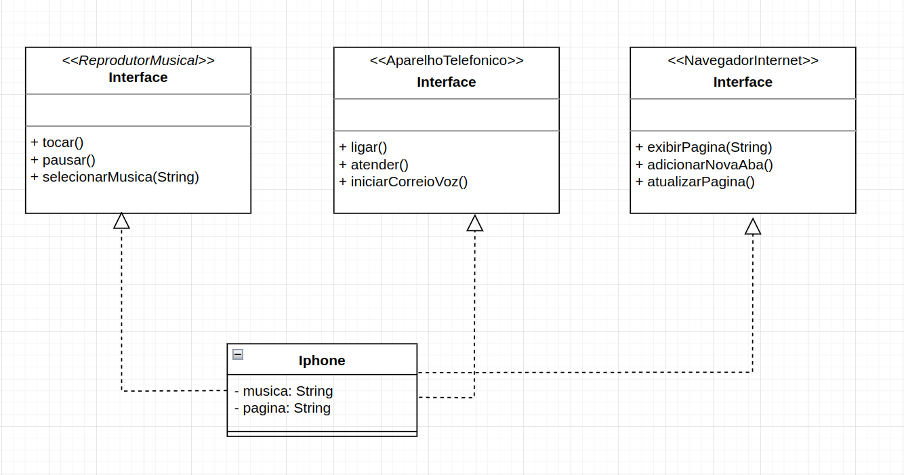

# Diagramação de Classes do iPhone

Eu pensei na diagramação do iPhone dessa forma, pois ele  pode ser considerado tanto como um: Reprodutor Musical, 
Aparelho Telefônico e Navegador na Internet.

## Referências
- https://glysns.gitbook.io/java-basico/programacao-orientada-a-objetos/interface
- https://github.com/digitalinnovationone/trilha-java-basico/tree/main/desafios/poo